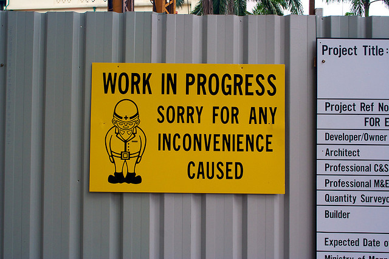

This update is long overdue. [Previously](/articles/async-await-through-the-looking-glass/), I wrote: 

>But as I learned today, once you do hit the `await` statement, you are still leaving the stack. And when the `await` returns, the place you come back to may not be identical to the place you left, depending on how it got there.
>
> ...
>
> The `fsw.Created` handler is called on a different thread than the one you just came from. That's a pretty well-known fact and is why the `FileSystemWatcher` has a `SynchronizingObject` property to help WinForms programmers navigate their way back to the UI thread. 

Well, it turns out my analysis was completely wrong. Actually, my application was modifying files in a folder that belonged to an ASP.NET website. Modifying folders inside of ASP.NET can [cause application restarts](http://stackoverflow.com/questions/2248825/asp-net-restarts-when-a-folder-is-created-renamed-or-deleted). Though I've moved on from this project, I now believe that the behavior I was seeing had to do with the timing of the ASP.NET restart, and had nothing whatsoever to do with crossing thread boundaries. Since async/await uses continuations, any differences I was seeing between where I came from and where I got to had to occur outside of the bounds of my program.

We live, we learn.