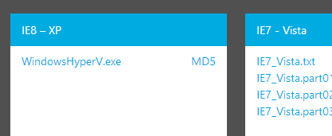

My laptop returned with one bad RAM stick missing. While it was gone, I discovered I prefer Windows 8.1 to its predecessor, especially the return of the start button and the improved start screen that installers cannot automatically colonize. I upgraded my laptop immediately.

Microsoft introduced more changes under the hood, though, and a few programs stopped working. One was [Bins](http://www.1upindustries.com/Bins/default.aspx) which I use to keep my browsers together, but they had a [fix available](http://feedback.1upindustries.com/forums/103687-bugs/suggestions/4681319-windows-8-1-werfault-exe-error-upon-starting-bins).

A more serious problem was the [Juniper Remote Desktop Client](http://www.eightforums.com/general-support/33644-upgrade-8-1-disaster.html). Without this, I was unable to complete my latest contract.

I saw two viable options: 

1. Rollback (noooo! not my new shiny toy!)
2. VM

Of course, #2 won. But I couldn't locate my Windows 8 installation disks, and was not about to fork over more cash just to run one program. The solution? [Modern.ie](http://modern.ie)! I grabbed a copy of XP with IE8, threw it into Hyper-V, and I'm back in business. 

While it's intended to ease the pain of backwards-compatible web development, modern.ie is also a great resource for emergency backwards-compatible Windows development. Somebody reports a Vista bug? Grab a Vista image and test. Need to check something on Windows Server 2012? That's there as well. The images have a 30 day grace period after which you need to purchase a license, so you cannot use the same OS indefinitely. But still, it's a very useful addition to my toolkit.