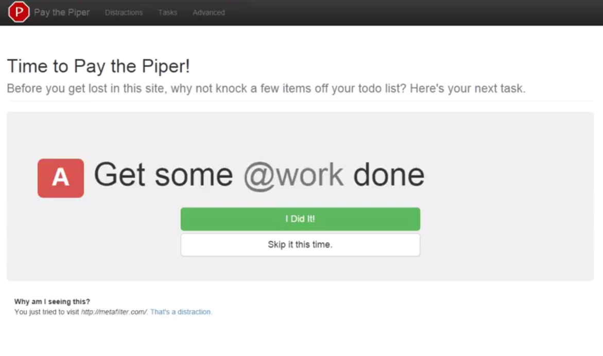

Today, I'm announcing the general availability of **[Pay the Piper](https://chrome.google.com/webstore/detail/pay-the-piper/iiepcdnmdcdplpmckjlaefajphcbelcm)**, the Google Chrome Extension that puts your todos to work -- fighting distractions!

If you're at all like me, you probably keep a task list somewhere. There are phone calls to make, books to drop off at the library, emails to send. Nothing terribly difficult. You also on occasion find yourself idly surfing the web. You know, just taking a break from your work. 

Somehow, when it's time to go home, you realize that none of your small tasks got done. How is this possible? How did you choose to look at one more cat video instead of crossing one small thing off that list?

Wouldn't it be great if, at the moment you were about to be distracted, you could be reminded to look at your todo list? Even better, wouldn't it be great if you could see the next thing you were supposed to get done?

**Pay the Piper keeps you productive by making you "pay" to visit distracting sites. The cost? One completed task from your task list.**

**Pay the Piper** protects you from your own bad habits by keeping you away from sites you know are distracting and focusing you back on your task list. Like a web blocker, you decide what sites are distractions to you, and Pay the Piper prevents you from viewing them. Unlike those other blockers, **Pay the Piper** replaces the distraction with a task from your task list. Completing any of your tasks grants you a few minutes to browse the distracting site. Hey, you've earned it!

**Pay the Piper** was built to augment the power of the [todo.txt](http://todotxt.com/) system and its Android/iOS apps. If you are a todo.txt user and your files are stored on Dropbox, **Pay the Piper** can use that task list as its source. But don't worry if you don't store your tasks there -- you can also create your own list inside of Chrome. Thanks to the power of Google Chrome Sync, all of your logged in Chrome browsers will share the same task list.

"I got things done this weekend that I didn't think I would have!" -- Jessie Rymph, founder, [Works Progress Seattle](http://www.worksprogressseattle.com)

<!-- Copy & Pasted from YouTube -->
<iframe width="560" height="315" src="http://www.youtube.com/embed/uXgfPZEgIhg?rel=0" frameborder="0" allowfullscreen></iframe>

&nbsp; 
&rsaquo; [**Pay the Piper** on the Google Chrome Web Store](https://chrome.google.com/webstore/detail/pay-the-piper/iiepcdnmdcdplpmckjlaefajphcbelcm)
