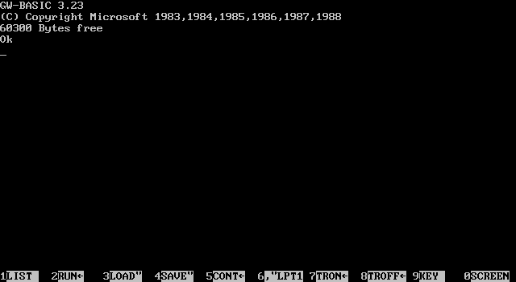

There's a great book on JavaScript called [JavaScript: The Good Parts](http://shop.oreilly.com/product/9780596517748.do) that every frontend developer should own. It does a great job of highlighting both the bad and good facets of the language. In that vein, here are some handy tips about VB to help you, intrepid C# programmer, find success.

1) Ignore the logical operators `And` and `Or`. These operators do not short-circuit, so an expression like 

    If a IsNot Nothing and a.Foo > 3 Then Debug.WriteLine("booo")

will give you a NullReferenceException. Instead use `AndAlso` / `OrElse`.

    If a IsNot Nothing AndAlso a.Foo > 3 Then Debug.WriteLine("yay")

2) `IsNot` adds a touch of readability. Compare:
    
    If Not a Is Nothing Then ...

vs.

    If a IsNot Nothing Then ...

It's more like natural language, which is VB's appeal after all.

3) Avoid `IIf()` for ternaries. Instead, use `If()`. The former is not a part of the core language so much as a built-in function, and all of its arguments are evaluated:

    Dim x as Integer = IIf(a IsNot Nothing, a.Foo, 0) ' NullReferenceException because a.Foo is evaluated

The latter, added in VB 9, maps to the same ternary operator that `?:` does in C#.

    Dim x as Integer = If(a IsNot Nothing, a.Foo, 0) ' Proper short-circuiting = no problem!

4) `Nothing` is not null -- it's `default(T)`. 

    Dim str as String = Nothing ' This is null.
    Dim lng as Long = Nothing ' This is 0.
    Dim dt as DateTime = Nothing ' This is DateTime.MinValue.
    Dim dt as DateTime? = Nothing ' This is null again!

Personally, I'd only use `Nothing` as a synonym for `null` and avoid the other usages. 

5) Remember, `Is` is for comparing object types, while `=` is for comparing value types. 

    Dim obj as Object
    If obj = Nothing Then Debug.WriteLine("boo") ' Error: obj is an object
    If obj Is Nothing Then Debug.WriteLine("yay") ' Will work
    Dim dt as DateTime
    if dt = Nothing Then Debug.WriteLine("oy") ' Also will work... but didn't I just say to not do this?
    if dt = DateTime.MinValue Then Debug.WriteLine("you're learning!") ' Much better

