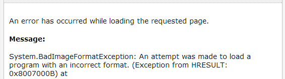

Another obnoxious exception that long-term C# developers are very familiar with is `BadImageFormatException`. When I see it, I think "there must be some kind of compilation mixup." As in, a third-party DLL isn't compiled as AnyCPU. Or a .NET 2.0 site is referencing a .NET 4.0 library. Generally it's an annoyance but easy to suss out.

Today I received an error report from my colleague where the application was throwing this very exception. I couldn't reproduce the problem on my machine, but he assured it happened every time on his (a 32-bit workstation) and on the test server (64-bit). 

The stack trace ended inside a call like this.

```cs
T CallWrapped<T>(IEnumerable<Func<T>> actions) {
    T output = default(T);
    foreach (var action in actions) {
        output = Combine(output, action());
    }
    return output;
}
```

On my machine, this executed fine. But on my colleague's, it would fail at the second `action()` call. The actions looked something like this:

```cs
TRetVal WrappedDelete(Entity entity) {
    var actions = new [] {
        () => LogDelete(entity),
        () => base.Delete(entity)
    };
    return CallWrapped<TRetVal>(actions);
}
```

I set a breakpoint on `base.Delete()` to see what was going on and hit F5. The breakpoint wasn't hit. What? Visual Studio won't step into native methods that fail (unless you ask it nicely), but I'd never seen it refuse to step into a managed method declared within the solution! I checked the Delete method just to see if there were any clues there...

```cs
public virtual TRetVal Delete(Entity entity) {
    // simple NHibernate stuff in here, nothing worth mentioning!
}
```

... but it was all perfectly [cromulent](http://en.wiktionary.org/wiki/cromulent) code that would have caused fury among users if it actually had any problems.

After numerous Google searches that went nowhere ("Make sure you're targeting the right platform!" shutupshutup), I finally [located the answer on StackOverflow](http://stackoverflow.com/questions/5290559/using-base-keyword-in-delegate-causes-system-badimageformatexception). It turns to be a [bug in the C# 4.0 compiler](https://connect.microsoft.com/VisualStudio/feedback/details/626550/badimageformatexception-on-simple-program-using-generics-and-lambdas). To reproduce it:

* Write a lambda (anonymous method, delegate, what have you)...
* that calls a `base` method...
* that is declared `virtual`...
* while running VS 2010 or below, or compiling with the C# 4.0 compiler

A workaround is to wrap the base method call in its own method, like so:

```cs
TRetVal WrappedDelete(Entity entity) {
    var actions = {
        () => LogDelete(entity),
        () => DoDelete(entity)
    };
    return CallWrapped<TRetVal>(actions);
}

private TRetVal DoDelete(Entity entity) {
    return base.Delete(entity);
}
```

